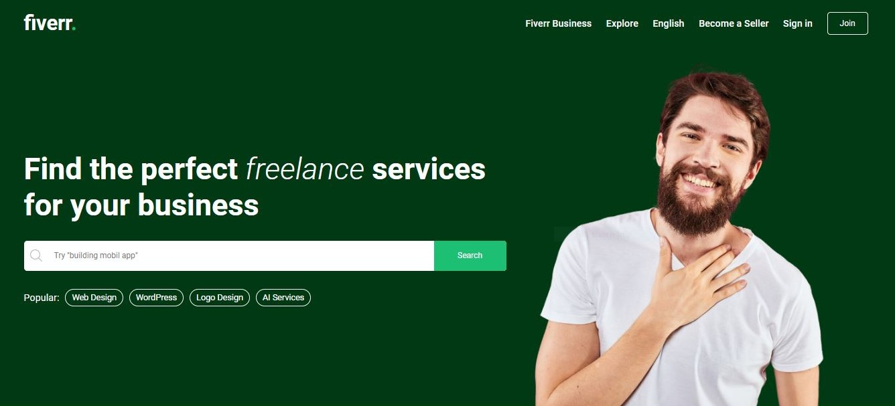

# fullstack-fiverr

<h1 align="center">
  Fiverr
</h1>

  

Built with a bunch of things, but to name a few:

- [Node.js]
- [Express]
- [React]
- [hooks]
- [react query]
- [SCSS]
- [MongoDB]
- [stripe payment gate]
